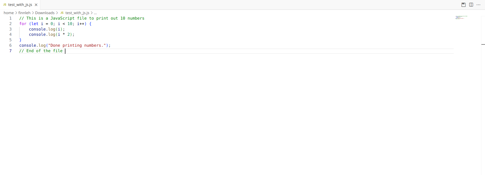
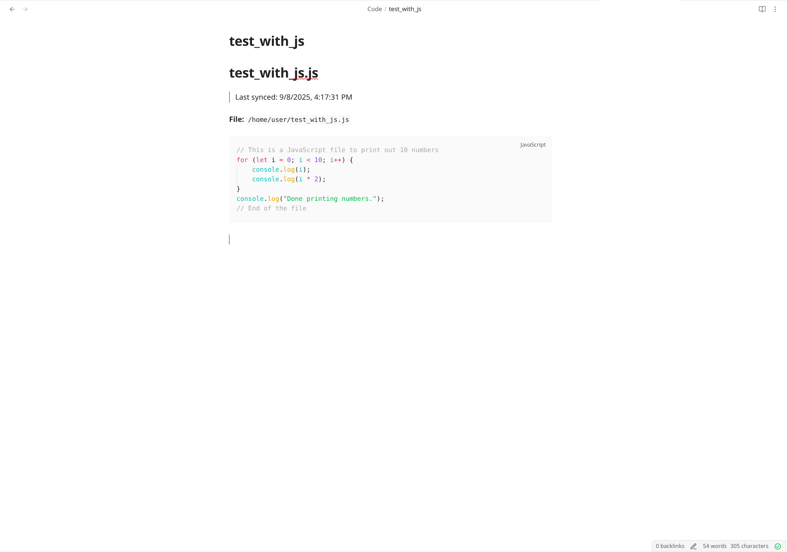

# Obsidian Code Sync

Seamlessly save your code files from VS Code directly to your Obsidian vault as beautifully formatted Markdown documents. Perfect for building a personal code knowledge base, documentation, or learning journal.

## Features





### 📝 One-Click Save to Obsidian
Save any code file to your Obsidian vault with a single keyboard shortcut (`Ctrl+Alt+O` / `Cmd+Alt+O`) or click the save button in the editor toolbar.


### 🔄 Auto-Sync on Save
Enable automatic syncing to keep your Obsidian vault always up-to-date. Every time you save a file in VS Code, it's automatically synced to your vault.

### 📁 Organized Structure
Your code files are automatically organized in a configurable subfolder (default: "Code") within your Obsidian vault, keeping everything tidy.

### ✨ Key Features:
- **Syntax Highlighting Preserved**: Code blocks maintain proper language-specific syntax highlighting
- **Keyboard Shortcut**: `Ctrl+Alt+O` (Windows/Linux) or `Cmd+Alt+O` (Mac) for quick saving  
- **Editor Toolbar Button**: Quick access button in the editor title bar
- **Timestamps**: Optional timestamps to track when code was last synced
- **Smart Language Detection**: Automatically detects programming language for proper syntax highlighting
- **Custom Subfolder**: Configure where files are saved within your vault
- **File Path Preservation**: Original file paths are documented in the markdown

## Requirements

- VS Code version 1.75.0 or higher
- An Obsidian vault (just a folder on your computer where Obsidian stores notes)
- Write access to the Obsidian vault directory

## Extension Settings

This extension contributes the following settings:

* `obsidianSync.obsidianPath`: Path to your Obsidian vault directory (automatically set on first use)
* `obsidianSync.autoSync`: Enable/disable automatic syncing when files are saved (default: `false`)
* `obsidianSync.subfolder`: Subfolder name within vault to save code files (default: `"Code"`)
* `obsidianSync.addTimestamp`: Add timestamp to the markdown file showing last sync time (default: `false`)

### How to Configure:
1. Open VS Code Settings (`Ctrl+,` or `Cmd+,`)
2. Search for "Obsidian"
3. Configure your preferences

## Usage

### First Time Setup:
1. Open any code file in VS Code
2. Press `Ctrl+Alt+O` (or `Cmd+Alt+O` on Mac)
3. Select your Obsidian vault folder when prompted
4. Your file is now saved to Obsidian!

### Commands:
- **Obsidian: Save Current File to Obsidian** - Save the active file to your vault
- **Obsidian: Set Vault Path** - Change or set your Obsidian vault location

### Example Output:
A Python file `calculator.py` becomes `calculator.md` in Obsidian:

```markdown
# calculator.py

> Last synced: 1/15/2025, 10:30:00 AM

**File:** `/home/user/projects/calculator.py`

​```python
def add(a, b):
    return a + b

def subtract(a, b):
    return a - b
​```
```

## Known Issues

- The extension only works with local Obsidian vaults (not encrypted or cloud-only vaults)
- Large files (>10MB) may take a moment to sync
- Some special characters in filenames may need escaping

## Release Notes

### 0.1.0
Initial release with core features:
- Save code files to Obsidian vault
- Auto-sync capability
- Configurable settings
- Keyboard shortcuts and toolbar button
- Timestamp support
- Smart language detection for 30+ programming languages

---

## Contributing

Found a bug or have a feature request? Please open an issue on [GitHub](https://github.com/FinnLeh/vscode-obsidian-sync/issues).

Pull requests are welcome! 

## License

MIT License - see [LICENSE](LICENSE) file for details

## Credits

Created by Finn Lehmann

**Enjoy building your code knowledge base!** 🚀